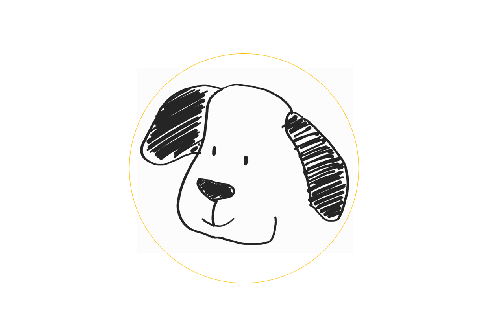
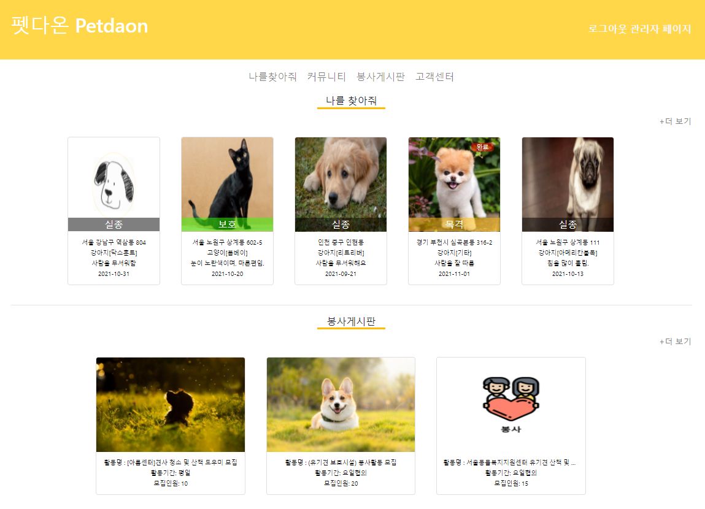
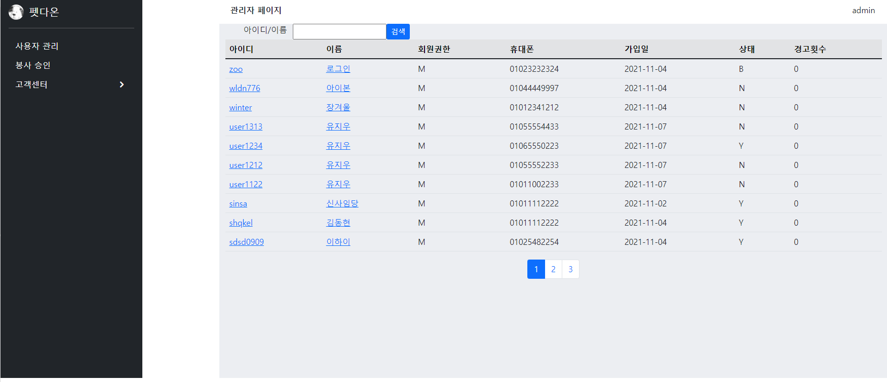

### <펫다온>프로젝트

<ul>
  <li>유기,유실 동물 정보 공유 및 봉사 참여 웹페이지 프로젝트</li>
  <li>6인 팀프로젝트(이진표/염지영/유지우/최지원/장영인/김경태)</li>
  <li>KH 정보교육원 세미프로젝트</li>
</ul> 
 
### 프로젝트 기간

2021.10.04~2021.11.07

### 프로젝트 개요

 반려동물과 반려동물을 키우는 사람들에게 도움을 줄 수 있는 사이트를 고민하다 펫다온이라는 사이트를 만들게 되었습니다. 다온은 순우리말로 ＇모든 좋은 일들이 다 온다’ 라는 의미를 지니고 있습니다.  저희는 이러한 다온이란 단어에 ‘펫’이라는 단어를 붙여 펫과 함께라면 반려동물과 사람 모두에게 좋은 일들이 온다라는 의미를 부여해보았습니다. 이와 더불어, 펫다온을 거꾸로 하면 온다펫으로 펫이 나에게 오며 입양 동물들과 잃어버린 반려동물들이 온다는 마음을 담았습니다. 
 
 
 저희 사이트에는 반려동물에 관한 이야기를 자유롭게 할 수 있는 자유게시판, 유기동물 봉사를 할 수 있는 봉사게시판, 실종, 보호, 발견 신고를 할 수 있는 나를찾아줘 게시판을 만들어 보았으며, 반려동물을 사랑하는 사람들끼리 소통하며 반려동물에게 도움을 주고자 펫다온 웹사이트를 기획해보았습니다.

  
-기획 회의록: https://toothsome-paint-e10.notion.site/2d641ed8df784d218e486ba804d05cbc?v=afcaa049c7d9459ab4d0baf34e3a84ac
  
### 웹 어플리케이션 주요기능

1. 관리자 페이지 
<ul>
    <li>사용자 관리 : 회원정보조회(기본정보, 유기견찜목록, 분양받은 유기견), 정보 업데이트(팝업)</li>
    <li>봉사 승인 : 사용자 등록 봉사 게시글 승인 처리</li>
    <li>고객센터 : 공지사항, 1:1문의, 신고내역 처리</li>
</ul>
2. 유저페이지 
<ul>
     <li>메인 : '나를 찾아줘', '봉사' 게시판, 공지사항 최신글 목록, 입양/임보 관련 사이트 목록</li>
     <li>회원 : 로그인, 로그아웃, 마이페이지(개인정보수정, 봉사 신청 확인, 봉사 등록 확인),</li>
     <li>나를 찾아줘 : kakao map api 사용한 유실 동물 위치 공유 서비스</li>
     <li>커뮤니티 : 사용자들 간 자유롭게 소통할 수 있는 공간</li>
     <li>봉사 등록 : full calendar api사용한 봉사 목록 확인과 봉사 등록 및 신청</li>
  <li>고객센터 : 공지사항 확인. 1:1문의 내역 확인 및 등록 </li>
</ul>

### 사용언어

JSP / SQL / JSTL / JAVA / AJAX / JQUERY / HTML/CSS / JAVASCRIPT

### WAS

Apache Tomcat9.0

### DataBase

ORACLE version 21.2.0.187

### Tool

Eclipse IDE for Java Developers (includes Incubating components) / jdk-11.0.2 / CHROME / SQL DEVELOPER

### 개발 이미지(완료)
 

 <h4>사용자메인</h4>

 <h4>관리자 메인</h4>

git hub 자료 : https://github.com/JPLEE1991/petdaon

-사용자 
ID: kh1231 / PW: 1234

-관리자
ID: admin / PW: 1234
